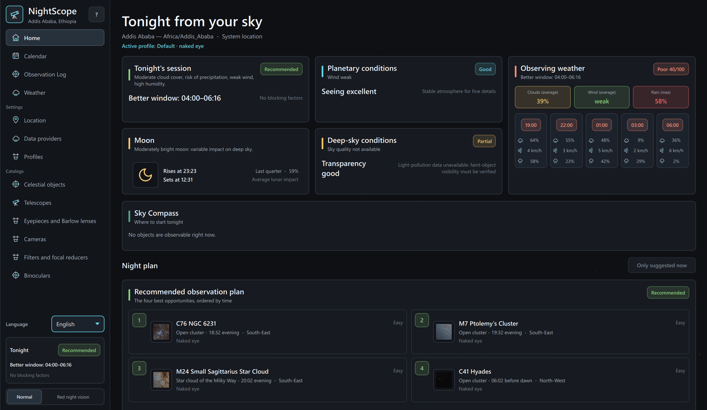

# NightScope

<p align="center">
  
</p>

<p align="center">
  <a href="https://beastmen84.github.io/NightScope/">Official website</a> ·
  <a href="https://github.com/beastmen84/NightScope/releases">Downloads</a> ·
  <a href="manuale.html">User manual</a>
</p>

NightScope is a Windows and Linux desktop application for planning visual and
photographic astronomy sessions. It combines local astronomical calculations,
an observer location, weather and sky-quality data, and the equipment in the
active profile to answer a practical question: **what is worth observing
tonight, from here, with this setup?**

> [!NOTE]
> NightScope is a released application. The current public portable builds are
> Windows 1.46.13 and Linux 1.43.0. Source version 1.46.17 includes review
> corrections not yet in either public package. Features added after 1.43.0
> are not yet in the published Linux package.
> Release artifacts remain platform-specific portable builds rather than
> universal installers.

Current public downloads:

- Windows: [NightScope 1.46.13](https://github.com/beastmen84/NightScope/releases/tag/v1.46.13),
  published as a portable Windows x64 ZIP.
- Linux: [NightScope 1.43.0](https://github.com/beastmen84/NightScope/releases/tag/v1.43.0),
  published as a Debian 12 x86-64 tarball with an adjacent SHA-256 file.

The `v1.46.13` release contains only the Windows package and points to source
tag `v1.46.13`. Linux downloads remain on `v1.43.0`; consult each release for
its own source, package and checksum information.

## What It Does

- Builds a local observing night from sunset to sunrise for the selected
  location and IANA timezone.
- Calculates Sun, Moon, planet, Messier, Caldwell, and enabled NGC visibility
  with Skyfield.
- Produces a short observing plan and target-specific alternatives instead of
  exposing internal raw scores.
- Evaluates every telescope or binocular in the active profile for each target;
  a profile without either instrument uses naked-eye mode.
- Suggests practical telescope, eyepiece, Barlow, filter, and reducer context
  while keeping optical compatibility and recommendation ranking separate.
- Shows annual astronomical events, short-horizon visible ISS passes, and
  multi-night comet windows in one calendar.
- Provides live directional guidance through Sky Compass.
- Stores observation logs and user-maintained equipment locally.
- Provides a separate two-column Cameras catalogue for astronomy cameras and
  interchangeable-lens camera bodies. Its sensor and capture specifications
  can be assigned to profiles and feed a typed, isolated photographic
  configuration scorer, a conservative still-exposure advisor and a Solar
  System video advisor. An on-demand runtime assembler now connects those
  layers to the active-profile inventory and current conditions; Object Detail
  shows their result in a separate photographic card and the visual engine
  never consumes them.
- Supports integrated smart telescopes as an explicit third equipment path.
  Seestar S30/S50 use their persisted primary sensor and optical train, never
  profile eyepieces, external cameras, reducers, or Barlows. Custom smart
  models expose capability and sensor fields; incomplete specifications remain
  assignable but fail closed instead of producing synthetic advice.
- Lets each profile record, for each assigned telescope, whether the user has
  declared a certified full-aperture solar filter secured in front of the
  instrument. The static scorer accepts this capability only as an exact
  caller-supplied telescope set, and it never changes visual ranking.
- Uses 16 matching, clearly labelled AI-generated category illustrations for
  all deep-sky catalogues, while retaining the nine credited Solar System
  photographs. Category artwork is not a picture of the selected target;
  the previous 219 Messier/Caldwell cutouts are no longer shipped.
- Lets you click an object's picture, or use its image-management button, to
  preview and save a local personal JPEG/PNG, replace it, or restore the default.
  Catalogue aliases share the same picture. Originals are untouched; optimized
  copies and thumbnails stay in `user_images` beside the runtime database.
  Keep that directory with the database in backups; the manual explains restore
  and the separate Linux data/configuration paths.
- Includes an offline celestial catalogue with 7,585 distinct deep-sky
  targets, 7,839 NGC designations deduplicated across physical identities,
  and nine Solar System targets. The 219 curated Messier/Caldwell targets and
  Solar System objects retain their complete descriptions and facts;
  95 NGC-only targets (75 galaxies and 20 planetary nebulae)
  now also have reviewed Italian, English, and Spanish editorial content,
  while the remaining NGC-only entries
  are explicitly marked as work in progress. Six remediation passes cover
  197 historical objects with field-scoped, three-language reviews. The final
  remediation pass corrects 92 residual descriptions and five scientific
  curiosities;
  similarity screening now checks shared sentences inside otherwise different
  paragraphs as well as whole-text templates, with no detected residuals.
  Per-target Home eligibility is persistent; row updates are immediate and
  recommendation recalculations are coalesced in the background.
  Filtered results can also be enabled or disabled in one confirmed, atomic
  operation; catalogue aliases count once and Solar System objects stay locked.
- Switches the application and its content between Italian, English, and
  Spanish at runtime.
- Provides a persistent low-luminance red interface for use at the telescope;
  astronomical photographs and plan thumbnails are suppressed in this mode.
- Checks for newer stable releases after startup and links directly to the
  official GitHub download page without downloading or installing anything.

NightScope is a decision-support tool, not a planetarium, telescope-control
system, or substitute for an astronomical atlas.

## How Recommendations Work

The recommendation path combines four distinct layers:

1. **Astronomical geometry**: darkness, altitude, useful observing interval,
   culmination, Moon separation, and Moon illumination.
2. **Local conditions**: forecast cloud cover, humidity, wind, visibility,
   estimated seeing and transparency, plus real sky-background data when
   available.
3. **Observer capability**: active-profile instruments, aperture, focal length,
   eyepieces, Barlows, and whether the target is realistic with the selected
   setup or with the naked eye.
4. **Session context**: timing, target competition, useful duration, data
   completeness, and whether the night is currently recommended, worth
   monitoring, or discouraged.

Internal quality values are implementation details. The UI presents useful
windows, limiting factors, confidence and concrete setup guidance. Missing data
is not replaced with optimistic synthetic values: for example, Bortle and SQM
remain unavailable when NightScope has no real local source.

ISS passes and comet windows deliberately bypass object scoring, Equipment,
Planner, and the NightScope observation model. They are transient calendar
events. Comet brightness is inherently uncertain and is presented as an
estimate rather than a precise promise.

In the current UI, filters and focal reducers remain presentation guidance and
do not change visual target ranking. The separate photographic backend can
enumerate an exactly linked imaging reducer and recalculate its camera field,
sampling and static configuration suitability. Its on-demand runtime assembler
uses only the active profile's telescopes, cameras, reducers and Barlows. For
still candidates it returns broadband sub-exposure and total-integration ranges
from the current sky, atmospheric-transparency and Moon inputs. For video
candidates it returns a target-specific single-clip duration, an FPS planning
range and an indicative captured-frame range without assuming ROI or image
derotation. Object Detail presents this result in a separate imaging-plan card
below the visual setup: optical train, field of view, image scale, exposure or
video ranges, confidence and the most relevant operational limits. The
presentation is computed for the selected target only; it does not change Home,
Planner, visual Equipment, Sky Compass, visual recommendations or NSOM. For a
smart telescope, the same card uses its integrated sensor, describes
sub-exposures as device-managed, emphasizes cumulative live-stacking time,
offers mosaic guidance only when the model declares it, and warns when a
planet is poorly sampled at native scale. A smart-only visual setup never
invents magnification or exit-pupil values; it routes the user to this separate
EAA plan. Mixed profiles keep traditional visual and external-camera paths
separate from smart integrated trains.
If a still estimate exceeds the finite 15-hour planning ceiling, the card shows
a cumulative lower bound instead of an exact `15-15 h` range and states that
usable light frames may span multiple nights. A target that never reaches
30 degrees receives a separate deep-sky imaging warning; the visual observing
window is not relabeled as an ideal photographic window.

Reducer compatibility is fail-closed: only explicit telescope-model links are
used by either visual reducer guidance or the photographic train builder.
Unconfigured reducers remain available in the catalogue and profiles but are
excluded from both recommendation paths until the user links at least one
telescope. User-created telescope models appear in the same compatibility
selector. Eyepiece and Barlow barrel diameter is deliberately not modeled
because telescope-side visual-back/focuser compatibility is not available;
legacy user values are retained as neutral notes during migration. Barlows
with the same multiplier are treated as optically equivalent by the current
visual and photographic calculations.

Telescope mount types use stable controlled codes instead of free text. This
preserves the existing visual recommendation behavior while keeping manual,
tracking, GoTo, PushTo, fork, alt-azimuth and equatorial capabilities distinct
for the separate photographic scorer.

Solar-filter availability belongs to the profile-to-telescope assignment, not
to the global telescope model. It defaults to disabled, is isolated between
profiles and instruments, and changes only photographic inventory state. The
runtime assembler forwards only filtered telescope IDs that are also assigned
to the active profile. The scorer defaults to no Sun candidate and admits only
matching configurations, so a stale or unrelated declaration cannot authorize
solar guidance.

The full model and its boundaries are documented in
[`docs/CALCULATION_LOGIC.md`](docs/CALCULATION_LOGIC.md) and
[`docs/NIGHTSCOPE_OBSERVATION_MODEL_1_0.md`](docs/NIGHTSCOPE_OBSERVATION_MODEL_1_0.md).

## Data And Network Use

Most catalogue, timezone, equipment, ephemeris, propagation, and recommendation
work is local. Network access is used only for current or optional external
data.

| Source | Purpose | Account | Location sent |
| --- | --- | --- | --- |
| Open-Meteo | Hourly weather forecast | No | Yes |
| System location (Windows/GeoClue) | OS location | No | Stays in the OS/app |
| GeoNames | Offline city search and labels | No | No |
| Minor Planet Center | Offline MPC observatory search | No | No; packaged snapshot |
| timezonefinder | Offline IANA timezone lookup | No | No |
| CelesTrak | ISS orbital elements | No | No |
| JPL SBDB | Comet orbital elements | No | No |
| NASA Earthdata / LAADS | VIIRS sky background and MAIAC AOD | Optional login | Yes |
| OpenAQ | Local particulate measurements | Optional API key | Yes |
| IP geolocation fallback | Approximate location after explicit user action | No | Public IP is visible to the service |

The localized **Data providers** page includes step-by-step setup guides. For
the Earthdata/LAADS flow used by NightScope, complete every profile field,
including fields marked optional, before testing the connection. First access
may also require LAADS OPeNDAP application authorization followed by a second
connection test.

CelesTrak and JPL downloads provide orbital catalogues; NightScope performs the
location-specific pass and visibility calculations locally. External results
are cached in SQLite with source-specific refresh and staleness rules.

See [`astro_viewer/data/DATA_SOURCES.md`](astro_viewer/data/DATA_SOURCES.md) for
catalogue provenance and [`docs/IMAGE_ASSET_POLICY.md`](docs/IMAGE_ASSET_POLICY.md)
for image attribution and redistribution policy.

## Privacy And Local Files

NightScope does not require a NightScope account. The portable Windows
application keeps its runtime data next to the executable:

- `nightscope.db`: location, profiles, catalogues, caches, and observation log;
- `user_preferences.json`: interface and provider state;
- `location_cache.json`: last location acquisition result; approximate IP
  fallback data is accepted for at most 24 hours and is labelled as cached;
- `logs/`: rotating diagnostic logs.

On Linux, NightScope follows the XDG base-directory contract:

- `~/.local/share/NightScope`: SQLite database and database backup;
- `~/.config/NightScope`: interface and provider preferences;
- `~/.cache/NightScope`: location and NASA AOD caches;
- `~/.local/state/NightScope/logs`: rotating diagnostic logs.

Absolute `XDG_DATA_HOME`, `XDG_CONFIG_HOME`, `XDG_CACHE_HOME`, and
`XDG_STATE_HOME` values replace the corresponding defaults. The developer-only
`NIGHTSCOPE_RUNTIME_DIR` override keeps every runtime file together in one
isolated directory for tests and smoke checks.

Exact coordinates are therefore local application data, but they are sent to a
provider when that provider needs a location-specific result, as shown above.
Earthdata passwords and OpenAQ API keys are stored through `keyring`: Windows
uses its credential vault, while Linux requires an available freedesktop.org
Secret Service over the desktop D-Bus session. NightScope does not accept a
plaintext or arbitrary fallback backend on Linux. If Secret Service is absent,
the credential controls report secure storage as unavailable. Secrets are not
written to the SQLite database or JSON preferences. Diagnostic logs
intentionally avoid coordinates and credential identifiers.

Back up `nightscope.db`, `user_preferences.json`, and `location_cache.json`
before replacing or moving a development build.

## Requirements

- Windows 10 or Windows 11 for the Windows portable application.
- An x86-64 Linux system with glibc 2.36 or newer for the Debian-baseline
  portable application; see the compatibility matrix below.
- Python 3.12 or newer for source development.
- A writable checkout for source development; the Windows portable application
  also stores its runtime files beside the executable.

Linux source execution and the portable bundle additionally require a desktop
D-Bus session. GeoClue and a Secret Service implementation enable automatic
system location and secure credential storage respectively.

### Linux Portable Compatibility

The tarball is an x86-64 glibc build, not a distribution-specific `.deb` and
not a universal Linux binary. These are the current compatibility expectations:

| Status | Distributions |
| --- | --- |
| Validated by release smoke tests | Debian 12, Debian 13, Ubuntu 26.04 |
| Expected to work, but not directly release-tested | Ubuntu 24.04 or newer, Linux Mint 22 or newer, current Fedora releases, Arch Linux and up-to-date derivatives, openSUSE Tumbleweed, and other x86-64 glibc distributions satisfying the baseline |
| Outside the declared binary baseline | Debian 11 or older, Ubuntu 22.04, Linux Mint 21, RHEL/Rocky Linux/AlmaLinux 9, openSUSE Leap 15, Alpine Linux or another musl-based distribution, and ARM/AArch64 systems |

On an unlisted distribution, check the architecture and glibc version with:

```bash
uname -m
getconf GNU_LIBC_VERSION
```

The reported values must be `x86_64` and glibc 2.36 or newer. Meeting that
baseline is necessary but does not replace the required desktop libraries,
graphics drivers, D-Bus session, or a test on that distribution. Package names
outside Debian and Ubuntu differ from the examples below.

## Install The Portable Linux Bundle

The Linux artifact is built on Debian 12 x86-64 with glibc 2.36. It does not
require Python or a virtual environment. Install the host packages used by Qt,
GeoClue, Secret Service, and the optional X11/XCB fallback:

```bash
sudo apt update
sudo apt install dbus-user-session geoclue-2.0 gnome-keyring \
  libsecret-1-0 libgl1 libegl1 libxkbcommon-x11-0 libxcb-cursor0 \
  libxcb-icccm4 libxcb-image0 libxcb-keysyms1 libxcb-render-util0 \
  libxcb-shape0 libxcb-xkb1
```

Download both release assets into the same directory, verify the checksum,
extract the bundle, and start NightScope:

```bash
sha256sum --check NightScope-v1.43.0-debian-12-x64.tar.gz.sha256
tar -xzf NightScope-v1.43.0-debian-12-x64.tar.gz
./NightScope/NightScope
```

GeoClue provides automatic system location and Secret Service stores Earthdata
and OpenAQ credentials. NightScope can still start when either desktop service
is unavailable, but the corresponding integration is disabled. Runtime data
uses the XDG directories documented above and is not written into the extracted
application directory.

The archive includes NightScope's MPL license, Python/Qt third-party licenses,
the exact NightScope and Qt source links, and an audited manifest of native
Linux libraries. `LINUX_NATIVE_COMPONENTS.tsv` maps each bundled system ELF
file to its exact binary/source package version, SHA-256, Debian Sources or
Launchpad source page, and notice under `legal/linux-native`.

## Run From Source

From PowerShell in the repository root:

```powershell
python -m venv .venv
.\.venv\Scripts\python.exe -m pip install --upgrade pip
.\.venv\Scripts\python.exe -m pip install -r astro_viewer\requirements.txt
.\.venv\Scripts\python.exe -m pip install -r requirements-dev.txt
.\.venv\Scripts\python.exe astro_viewer\main.py
```

On Debian or Ubuntu Desktop, install the host services used by Qt, GeoClue,
Secret Service, and the optional X11/XCB fallback:

```bash
sudo apt install python3-venv dbus-user-session geoclue-2.0 gnome-keyring \
  libsecret-1-0 libgl1 libegl1 libxkbcommon-x11-0 libxcb-cursor0 \
  libxcb-icccm4 libxcb-image0 libxcb-keysyms1 libxcb-render-util0 \
  libxcb-shape0 libxcb-xkb1
```

Then create or populate the virtual environment from the repository root:

```bash
python3 -m venv .venv
.venv/bin/python -m pip install --upgrade pip
.venv/bin/python -m pip install -r astro_viewer/requirements.txt
.venv/bin/python -m pip install -r requirements-dev.txt
.venv/bin/python -m astro_viewer.main
```

On first start NightScope initializes its SQLite database from the packaged
schema and seed files. This can take longer than subsequent starts.

## Validation

Fast validation without coverage:

```powershell
.\.venv\Scripts\python.exe tools\run_checks.py --fast
```

Full validation with coverage:

```powershell
.\.venv\Scripts\python.exe tools\run_checks.py
```

Include an installed-environment dependency audit:

```powershell
.\.venv\Scripts\python.exe tools\run_checks.py --security
```

The standard runner performs dependency consistency, Ruff, production import
and protected-layer checks, exact Bandit-baseline review, bytecode compilation,
one parallel test-suite pass with unexpected warnings promoted to errors, a
backend smoke test, and normal/red QML smoke tests. Security mode additionally
runs `pip-audit`. More focused commands and the latest measured baseline are in
[`docs/TESTING.md`](docs/TESTING.md).

## Build For Linux

The release tarball should be built through the Debian 12 container, not on the
developer workstation. From the repository root, with Docker or Podman
installed:

```bash
./packaging/build_linux_debian12.sh
```

The wrapper creates a Debian 12/Python 3.12 build image, runs PyInstaller, and
writes the portable application to `dist/NightScope`. It then creates the
deterministic release archive and checksum:

`dist/NightScope-v1.46.17-debian-12-x64.tar.gz` and its adjacent `.sha256`
file. The inner build scripts copy the project notices, generate the installed
Linux Python dependency license archive, inventory every copied Debian ELF
file, bundle the matching copyright and common-license texts, and run the
platform-aware Qt/data/runtime-state/legal audit.

For a native Linux development build, `packaging/build_linux.sh` and
`packaging/archive_linux.sh` remain available and use `.venv` by default.
Test the frozen executable with an isolated runtime directory:

```bash
NIGHTSCOPE_RUNTIME_DIR=/tmp/nightscope-dist-smoke \
  dist/NightScope/NightScope --smoke-test
NIGHTSCOPE_RUNTIME_DIR=/tmp/nightscope-dist-smoke \
  dist/NightScope/NightScope --qml-smoke-test
```

The bundle is native to the Linux architecture and glibc baseline on which it
is built. It is a tarball, not an AppImage, Flatpak, Snap, `.deb`, or universal
Linux binary. `tools/audit_qt_bundle.py` rejects an unmanifested native library,
a changed digest, an invalid Debian/Ubuntu source URL, or a missing
copyright/common-license text before archiving.

## Build For Windows

```powershell
.\packaging\build_windows.ps1
```

PyInstaller writes the portable application to `dist\NightScope`. The build
includes QML, translations, the multilingual manual, catalogue seeds,
scientific images, GeoNames and MPC observatory data, timezone boundary data, and the local JPL
`de421` ephemeris.

The application writes its database, preferences, caches, and logs beside the
executable, so do not run it from a read-only directory. `dist` is intentionally
ignored by Git and must be rebuilt and independently smoke-tested for a release.
Run smoke, visual, and provider tests on a copy of the clean build: launching
NightScope creates local runtime state beside the executable. Before archiving
the untouched release copy, rerun:

```powershell
.\.venv\Scripts\python.exe tools\audit_qt_bundle.py dist\NightScope
```

The audit rejects databases, backups, preferences, caches, or logs left in the
release bundle.

## Project Layout

```text
astro_viewer/
  app/
    application/     Composition root and application workflows
    astronomy/       Local ephemerides, event and visibility calculations
    database/        SQLite bootstrap, repositories and migrations
    models/          Observation, equipment and recommendation contracts
    services/        Providers, domain services, caches and localization
    ui/              QML application and reusable controls
    viewmodels/      QML-facing read models and commands
  data/              Schemas, seeds, editorial batches and local reference data
  resources/         Icons, Solar System photographs and category artwork
  tests/             Deterministic unit, integration and presentation tests
  translations/      Runtime language packs and compiled Qt catalogues
docs/                 Architecture, model, testing and release documentation
packaging/            PyInstaller spec, hooks, and Windows/Linux build scripts
tools/                Validation and localization maintenance tools
website/              Static English/Italian/Spanish GitHub Pages website
manuale.html          Self-contained Italian/English/Spanish user manual
```

Architecture details are in
[`docs/ARCHITECTURE.md`](docs/ARCHITECTURE.md), with the `1.45.x` assessment in
[`docs/ARCHITECTURE_REVIEW_1_45.md`](docs/ARCHITECTURE_REVIEW_1_45.md). The
acceptance contract for the active multilingual catalogue-content phase is
[`docs/CATALOGUE_EDITORIAL_WORKFLOW.md`](docs/CATALOGUE_EDITORIAL_WORKFLOW.md).
The original release-readiness audit is retained in
[`docs/RELEASE_AUDIT.md`](docs/RELEASE_AUDIT.md); the
current approval gate is
[`docs/RELEASE_CHECKLIST.md`](docs/RELEASE_CHECKLIST.md).

## Known Limitations

- Local terrain, buildings, trees, horizon masks, and atmospheric extinction
  near the horizon are not modeled.
- Weather, AOD, particulate, and VIIRS availability depends on provider
  coverage, freshness, authorization, and quality gates.
- Comet magnitudes can differ materially from orbital-catalogue estimates.
- The photographic plan calculates sensor geometry and known backfocus
  spacing, but still cannot prove adapters, image circle, tracking accuracy or
  vignetting. Its exposure output is a broadband planning range, not a camera
  calibration: gain/ISO, read noise, autoguiding and filter passband remain
  explicit limitations. The 15-hour display ceiling is a lower-bound marker,
  not a claim that every difficult target requires exactly 15 hours.
  Planetary-video output is likewise a single-clip
  plan, not a capture preset: actual FPS, exposure/gain, ROI, codec,
  atmospheric dispersion, frame selection and derotation remain explicit
  limitations. Camera-body video crop/readout geometry is not inferred from
  the still sensor: field of view and image scale are shown as unverified, and
  prime focus wins otherwise equal optical alternatives.
- There is no installer, automatic updater, or artifact signature. The current
  portable release publishes its SHA-256 digest.
- The final manual and application visual matrix still requires a human pass on
  the release build.

Never observe the Sun through unfiltered optics. Use only a certified,
full-aperture solar filter mounted securely in front of the instrument. Do not
use eyepiece solar filters.

## Licensing And Attribution

NightScope includes data and images from sources with their own terms and
attribution requirements. In particular, GeoNames data is distributed under
CC BY 4.0, timezone boundary data used by `timezonefinder` is derived from
`timezone-boundary-builder` under ODbL 1.0, and every catalogue image retains
its source and credit metadata. The offline observatory snapshot retains
attribution to the International Astronomical Union Minor Planet Center.

NightScope is Copyright 2026 Davide Marchi and is licensed under the
[Mozilla Public License 2.0](LICENSE). The MPL applies to NightScope source
files; third-party components and packaged data retain their own licenses.

The consolidated notices, exact validated dependency inventory, Qt/PySide
LGPL information, source links, and data attributions are in
[`THIRD_PARTY_NOTICES.md`](THIRD_PARTY_NOTICES.md) and
[`THIRD_PARTY_LICENSES.txt`](THIRD_PARTY_LICENSES.txt). A public Windows build
must regenerate that inventory, pass the bundle-license audit, and identify its
exact corresponding public source commit.

## Release And Development Status

NightScope has stable public builds on separate platform versions: Windows
`1.46.13` and Linux `1.43.0`. The `master` branch can be ahead of either
published bundle while the next artifacts are validated. User-facing changes
and fixes are recorded in
[`astro_viewer/CHANGELOG.md`](astro_viewer/CHANGELOG.md); this README describes
the current source tree instead of duplicating the release history.
